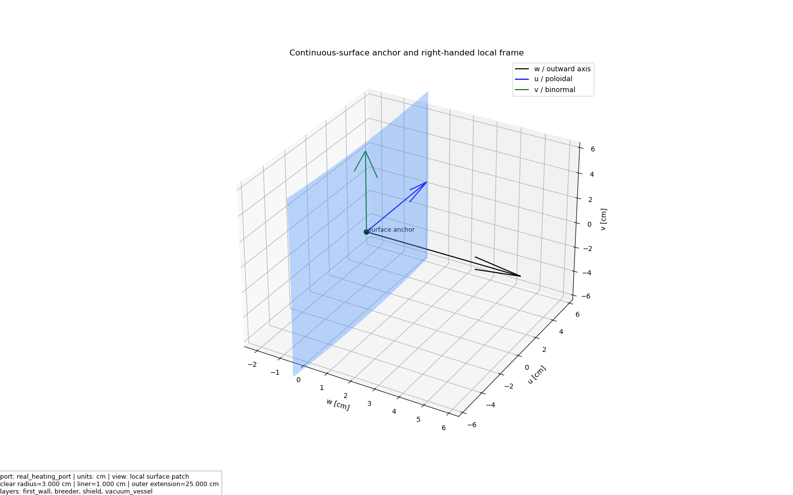
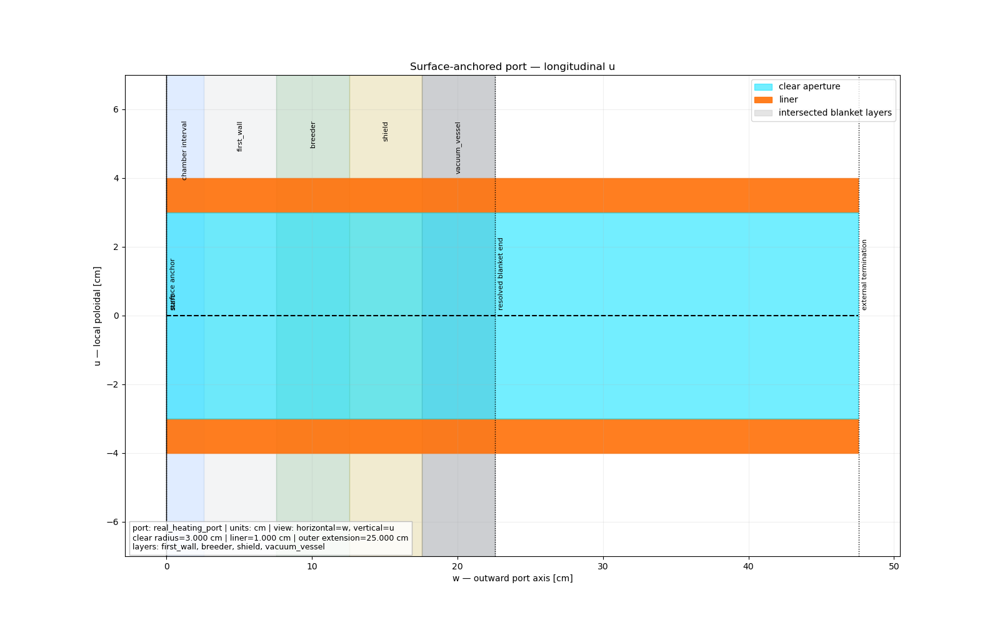
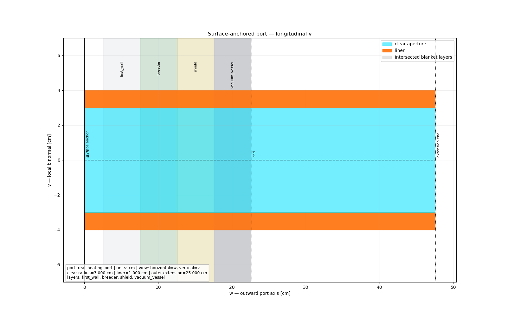
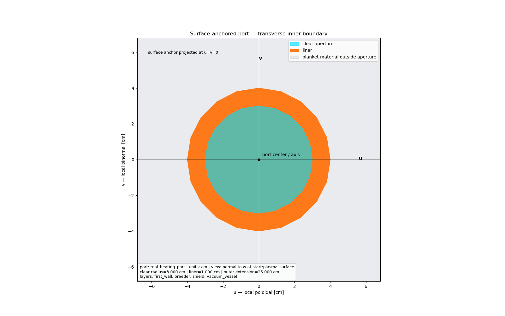
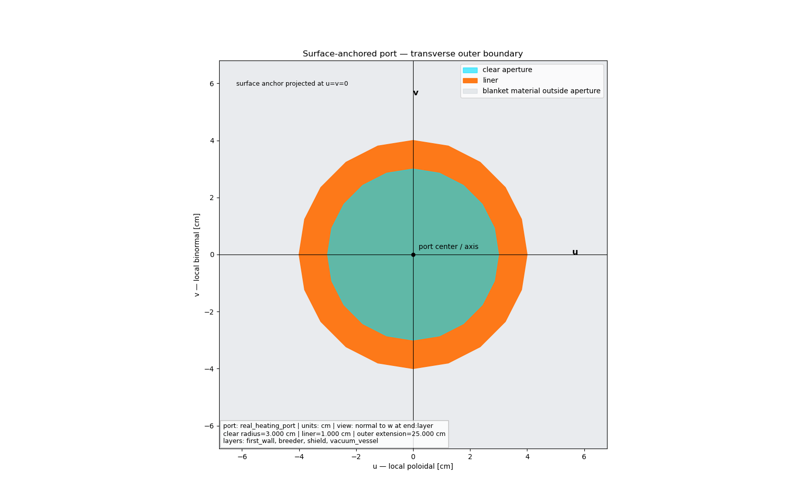
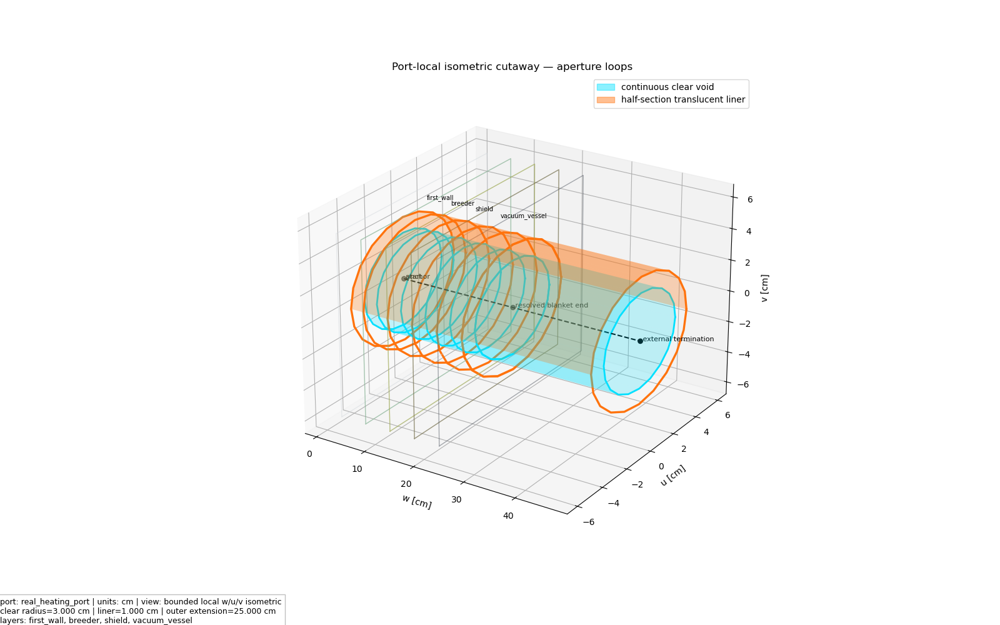
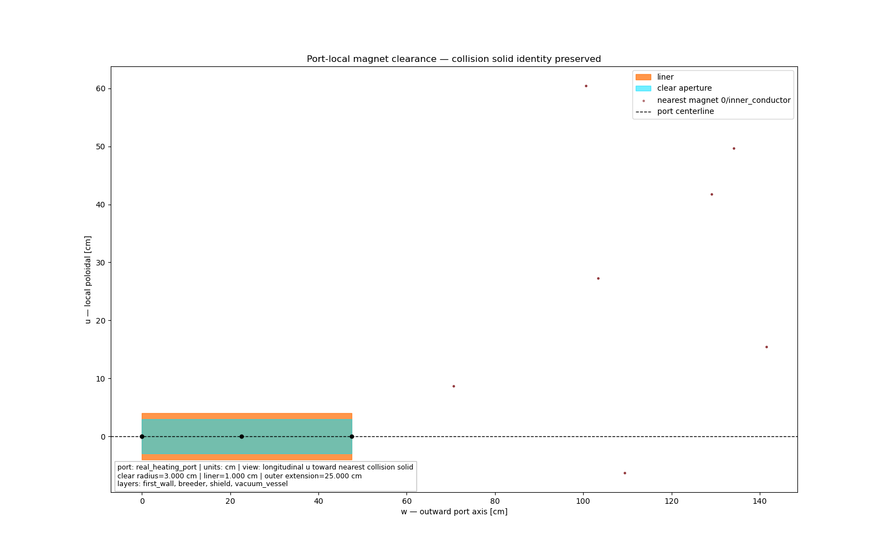
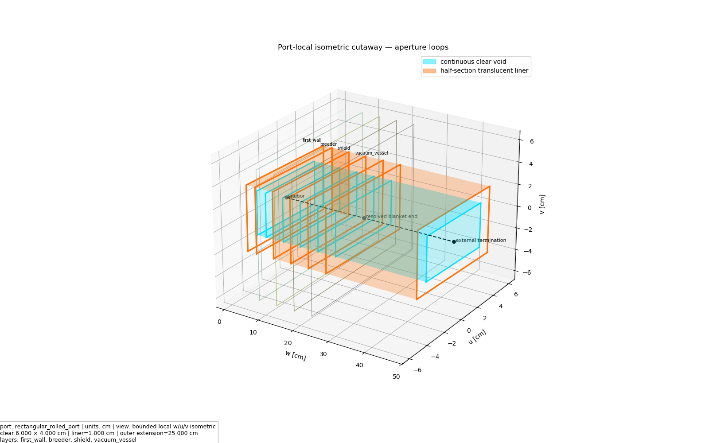

# Engineering ports and ducts

ParaStell's primary port model is a surface-anchored aperture. The anchor and
right-handed local frame are interpolated from the same continuous surface and
point cloud used by `InVesselBuild`; users specify toroidal/poloidal angles,
not point-cloud indices. Corresponding aperture rays are intersected with each
radial boundary to form ordered closed loops. Positive local `w` is outward,
local `u` is poloidal, and local `v = w × u`. Cartesian placement remains an
advanced legacy mode.

Cross-section dimensions always describe the **clear aperture**. A liner grows
outward from that opening: circular outer radius is `radius + thickness`, and
rectangular outer dimensions are `width + 2 * thickness` and
`height + 2 * thickness`. Resulting components are named `<name>__void` and,
when enabled, `<name>__liner`.

## Endpoint and extent semantics

`plasma_surface` resolves against the physical `s = 1` surface, independent of
whether the chamber is split. `wall_surface` resolves against `wall_s`.
`layer` resolves the unique connected centerline interval through an original
user layer; fraction 0 is its inner face and fraction 1 is its outer face.
`axial_offset` is applied after resolution: positive is outward and negative
is inward. `outer_extension` adds real duct geometry beyond the resolved end.

```yaml
invessel_build:
  ports:
    - name: equatorial_heating_port
      placement:
        mode: surface
        anchor:
          reference: plasma_surface
          toroidal_angle: 15.0
          poloidal_angle: 0.0
        axis:
          mode: outward_normal
          poloidal_tilt: 0.0
          toroidal_tilt: 0.0
        roll: 0.0
        max_search_length: 1000.0
      cross_section:
        shape: rectangle
        width: 40.0
        height: 25.0
        dimensions_are: clear_aperture
      extent:
        start: {reference: plasma_surface, axial_offset: 0.0}
        end:
          reference: layer
          layer: vacuum_vessel
          fraction: 1.0
          axial_offset: 0.0
        outer_extension: 150.0
      expected_layers: [first_wall, breeder, shield, vacuum_vessel]
      liner: {enabled: true, thickness: 2.0, mat_tag: SS316L}
      fill: {mat_tag: Vacuum}
      repetition: {mode: single}
      collision:
        magnet_policy: error
        clearance_policy: warn
        minimum_magnet_clearance: 10.0
```

A blind, circular, same-layer duct is written as:

```yaml
invessel_build:
  ports:
    - name: breeder_instrument
      placement:
        mode: cartesian
        anchor: [610.0, 0.0, 0.0]
        axis: [1.0, 0.0, 0.0]
        reference_direction: [0.0, 0.0, 1.0]
        max_search_length: 500.0
      cross_section:
        shape: circle
        radius: 20.0
        dimensions_are: clear_aperture
      extent:
        start: {reference: layer, layer: breeder, fraction: 0.10}
        end: {reference: layer, layer: breeder, fraction: 0.75}
        outer_extension: 0.0
      liner: {enabled: true, thickness: 1.5, mat_tag: SS316L}
      fill: {mat_tag: Vacuum}
      repetition: {mode: single}
      collision:
        magnet_policy: report
        minimum_magnet_clearance: 5.0
```

The old `layer_span` mapping remains accepted with a `DeprecationWarning` and
is migrated to the same endpoint model. Supplying both `extent` and
`layer_span` is an error.

## Visual validation package

`stellarator.export_port_local_validation(output_dir)` writes eight headless
1600 × 1000 views in the port-local frame plus a machine-readable semantic
manifest. Longitudinal views use `(w,u)` and `(w,v)` directly; transverse
views use equal-aspect `(u,v)` coordinates; the isometric view contains only a
bounded patch around the aperture. The manifest records the resolved frame,
loop counts, recovered dimensions, crop fractions, layer order, and the exact
magnet solid selected by collision checking.
















The non-circular regression uses a 6 cm × 4 cm rectangular clear aperture,
23° roll, 7° poloidal tilt, and −4° toroidal tilt. Its distinct local `u` and
`v` projections verify that rendering follows the resolved port frame.



The older global assembly exporter remains available for STEP/GLB inspection:

`stellarator.export_port_visual_validation(output_dir)` exports a named,
color-preserving STEP assembly, interactive GLBs, actual longitudinal and
transverse cutaways, headless PNG renders, and a SHA-256 manifest. Axis
markers, outer envelopes, and clearance envelopes are marked visual-only and
are never included in neutronics or volumetric-mesh geometry.

The representative validation below is the finalized four-layer CadQuery
sector with a circular clear aperture, an orange 1 cm liner, a 25 cm external
extension, and filament-derived magnets.


## Collision policies and report

`stellarator.check_port_magnet_clearance()` classifies each identified coil
conductor/casing pair as `collision`, `clearance_violation`, or `clear`.
Hard-collision and clearance policies accept `error`, `warn`, `report`, or
explicit `ignore`.

```json
{
  "port_name": "equatorial_heating_port",
  "coil_id": 3,
  "magnet_region_kind": "outer_casing",
  "actual_overlap_volume": 0.0,
  "clearance_envelope_overlap_volume": 12.4,
  "required_clearance": 10.0,
  "estimated_minimum_distance": 7.8,
  "status": "clearance_violation"
}
```

## Backend support

| Backend | Port behavior |
|---|---|
| CadQuery | Blanket cuts are driven by surface-intersection loops; comparison solids are regenerated from those loops |
| STEP | Void and liner exported as independently named solids |
| CAD-to-DAGMC | Not validated for surface-anchored ports in this implementation stage |
| Gmsh discrete PLC | The shared native facet complex is tetrahedralized without OCC or CAD imports |
| Legacy structured MOAB | Unported builds retain the existing one-tet-thick point-cloud mesh; ports are explicitly rejected |
| Native discrete-PLC MOAB | A supported surface port uses the same conformal facet complex as direct PyDAGMC and writes distinct volumetric H5M/VTK files |
| Direct native PyDAGMC | One surface-anchored port is exported from verified aperture loops with shared facets and explicit senses |
| CAD comparison | CadQuery solids regenerated from the loops remain a quantitative/STEP comparison, never a silent native-source fallback |
| Cubit | Not required or validated by the port implementation |

The standard volumetric API selects the backend without changing legacy
callers:

```python
stellarator.export_invessel_build_mesh_moab(
    components,
    "ported_sector_native_volume_mesh",
    output_dir,
    geometry_source="auto",  # auto, legacy_point_cloud, native_surface_complex
    min_mesh_size=15.0,
    max_mesh_size=45.0,
    aperture_chord_tolerance=0.05,
    vertex_merge_tolerance=1.0e-9,
)
```

`auto` keeps the legacy structured path for unported builds and chooses the
native discrete PLC for a supported port. The explicit legacy mode rejects any
port, while the explicit native mode rejects unsupported configurations. The
native path does not call CadQuery Boolean operations, CAD-to-DAGMC, or
`gmsh.model.occ.importShapesNativePointer`; the same unique vertex and facet
ledger supplies PyDAGMC and Gmsh discrete entities. The artifact helper remains
available when a validation ledger, facet renders, and both H5M forms are
needed together.

Circular aperture sampling defaults to a 0.05 cm maximum chord deviation.
Native vertex reuse defaults to a documented physical tolerance of 1e-9 cm;
coordinate decimal rounding is not the public merge contract. Volumetric JSON
reports include scaled Jacobian, mean ratio, radius ratio, dihedral extrema,
edge-length range, and per-threshold failure counts. The conservative default
failure thresholds are 1e-7 scaled Jacobian, 1e-5 mean ratio, 1e-12 radius
ratio, 1e-5° minimum dihedral, and 179.9999° maximum dihedral.

When magnets are present, native physical submodels are combined without local
graveyards. ParaStell rejects conflicting graveyards, adds exactly one global
graveyard after all physical volumes are present, fills every missing exterior
sense, and retains the enclosing graveyard boundary as the sole one-sided
surface.

Native export currently accepts exactly one `placement.mode: surface` port.
The existing Cartesian CadQuery behavior and unported PyDAGMC/MOAB paths are
unchanged. Production qualification uses independent `check_watertight` and
`overlap_check` tools plus a compiled OpenMC/DAGMC fixed-source run with a real
cross-section library; the exact commands and results live in the validation
artifact report rather than being inferred from file creation.

The representative full-assembly qualification used OpenMC 0.16.0 commit
`617d35a5063c57796b43428bc401e627d2011046` with DAGMC 3.2.4, PyDAGMC
0.0.1, and MOAB/PyMOAB 5.5.1. Geometry-debug, port-centerline,
liner, adjacent-blanket, and isotropic sector cases completed 26,000 total
histories with nonzero tallies, zero lost particles, and zero DAGMC navigation
errors against the magnet-inclusive global-graveyard H5M. The cross-section
manifest records the locally mounted NNDC HDF5 library and its SHA-256.

Volume closure uses `max(1e-7, 1e-7 * max(1, reference_volume))` in model
volume units. Disconnected centerline intervals, ambiguous far-side hits,
overlapping outer envelopes, sliver/invalid solids, and `per_period` repetition
are rejected explicitly.
