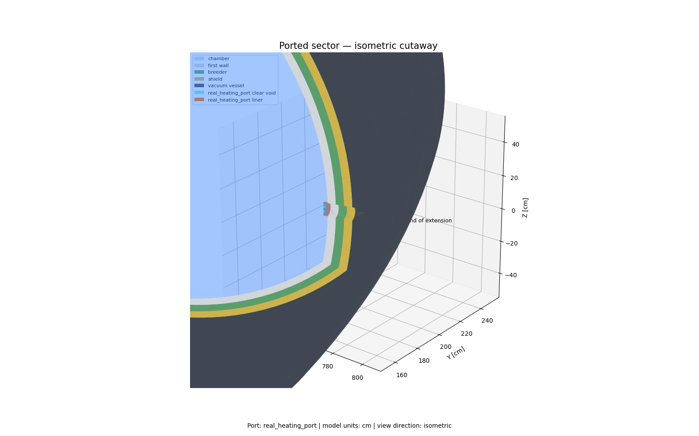
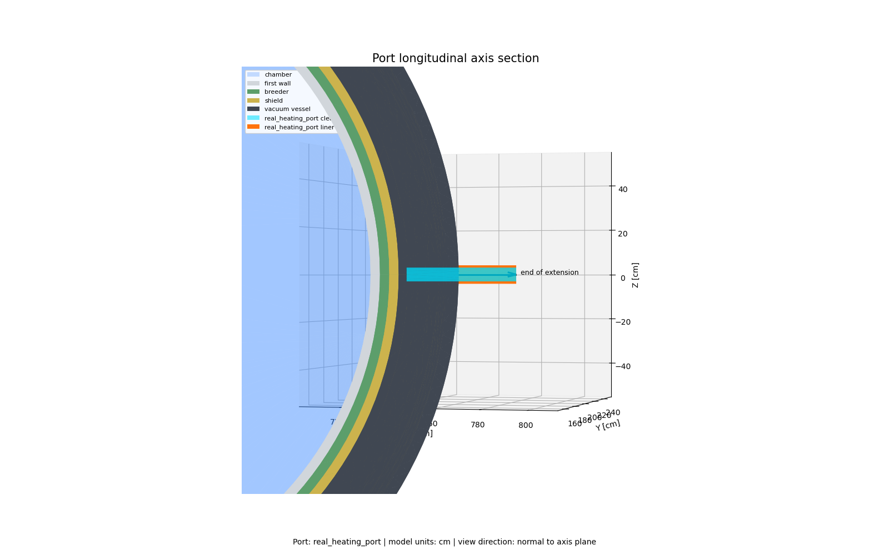
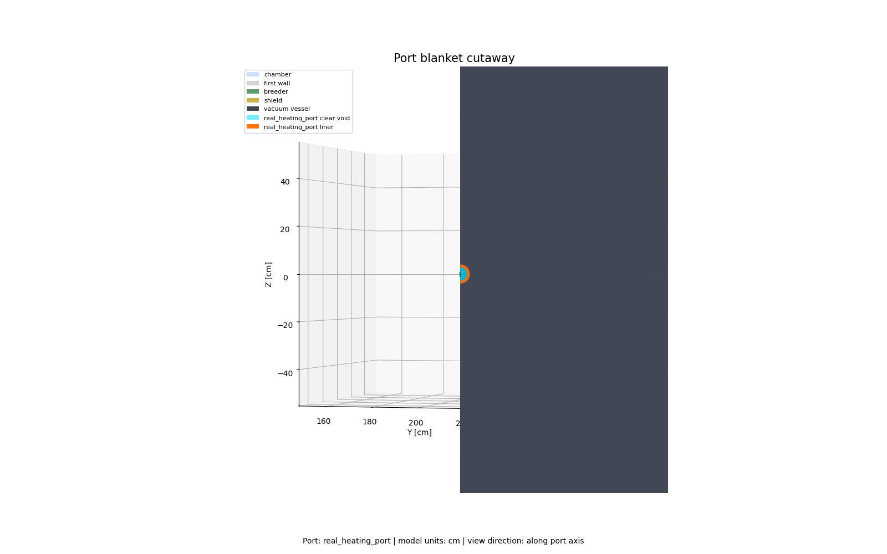
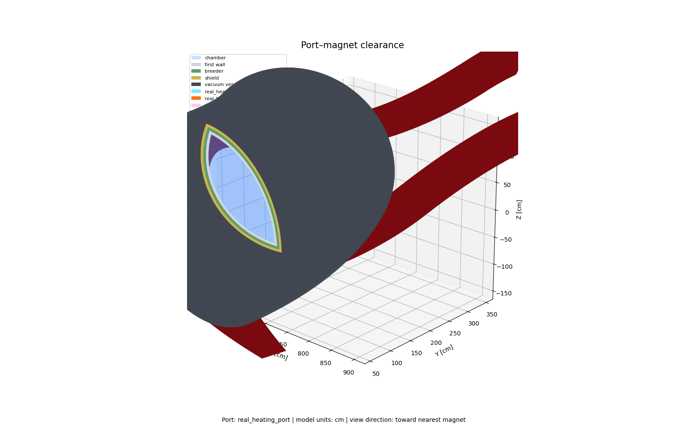
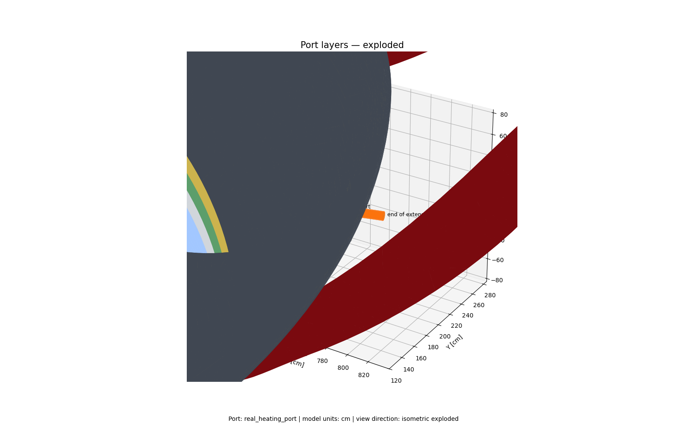

# Engineering ports and ducts

ParaStell ports follow the governing axis-plus-cross-section model: an
oriented axis establishes the duct centerline and a two-dimensional circle or
rectangle establishes its clear opening. Positive distance along `axis` is
from the plasma/inner side toward the blanket exterior.

Cross-section dimensions always describe the **clear aperture**. A liner grows
outward from that opening: circular outer radius is `radius + thickness`, and
rectangular outer dimensions are `width + 2 * thickness` and
`height + 2 * thickness`. Resulting components are named `<name>__void` and,
when enabled, `<name>__liner`.

## Endpoint and extent semantics

`plasma_surface` resolves against the physical `s = 1` surface, independent of
whether the chamber is split. `wall_surface` resolves against `wall_s`.
`layer` resolves the unique connected centerline interval through an original
user layer; fraction 0 is its inner face and fraction 1 is its outer face.
`axial_offset` is applied after resolution: positive is outward and negative
is inward. `outer_extension` adds real duct geometry beyond the resolved end.

```yaml
invessel_build:
  ports:
    - name: equatorial_heating_port
      placement:
        mode: cartesian
        anchor: [600.0, 0.0, 0.0]
        axis: [1.0, 0.0, 0.0]
        reference_direction: [0.0, 0.0, 1.0]
        max_search_length: 1000.0
      cross_section:
        shape: rectangle
        width: 40.0
        height: 25.0
        dimensions_are: clear_aperture
      extent:
        start: {reference: plasma_surface, axial_offset: 0.0}
        end:
          reference: layer
          layer: vacuum_vessel
          fraction: 1.0
          axial_offset: 0.0
        outer_extension: 150.0
      expected_layers: [first_wall, breeder, shield, vacuum_vessel]
      liner: {enabled: true, thickness: 2.0, mat_tag: SS316L}
      fill: {mat_tag: Vacuum}
      repetition: {mode: single}
      collision:
        magnet_policy: error
        clearance_policy: warn
        minimum_magnet_clearance: 10.0
```

A blind, circular, same-layer duct is written as:

```yaml
invessel_build:
  ports:
    - name: breeder_instrument
      placement:
        mode: cartesian
        anchor: [610.0, 0.0, 0.0]
        axis: [1.0, 0.0, 0.0]
        reference_direction: [0.0, 0.0, 1.0]
        max_search_length: 500.0
      cross_section:
        shape: circle
        radius: 20.0
        dimensions_are: clear_aperture
      extent:
        start: {reference: layer, layer: breeder, fraction: 0.10}
        end: {reference: layer, layer: breeder, fraction: 0.75}
        outer_extension: 0.0
      liner: {enabled: true, thickness: 1.5, mat_tag: SS316L}
      fill: {mat_tag: Vacuum}
      repetition: {mode: single}
      collision:
        magnet_policy: report
        minimum_magnet_clearance: 5.0
```

The old `layer_span` mapping remains accepted with a `DeprecationWarning` and
is migrated to the same endpoint model. Supplying both `extent` and
`layer_span` is an error.

## Visual validation package

`stellarator.export_port_visual_validation(output_dir)` exports a named,
color-preserving STEP assembly, interactive GLBs, actual longitudinal and
transverse cutaways, headless PNG renders, and a SHA-256 manifest. Axis
markers, outer envelopes, and clearance envelopes are marked visual-only and
are never included in neutronics or volumetric-mesh geometry.

The representative validation below is the finalized four-layer CadQuery
sector with a circular clear aperture, an orange 1 cm liner, a 25 cm external
extension, and filament-derived magnets.











## Collision policies and report

`stellarator.check_port_magnet_clearance()` classifies each identified coil
conductor/casing pair as `collision`, `clearance_violation`, or `clear`.
Hard-collision and clearance policies accept `error`, `warn`, `report`, or
explicit `ignore`.

```json
{
  "port_name": "equatorial_heating_port",
  "coil_id": 3,
  "magnet_region_kind": "outer_casing",
  "actual_overlap_volume": 0.0,
  "clearance_envelope_overlap_volume": 12.4,
  "required_clearance": 10.0,
  "estimated_minimum_distance": 7.8,
  "status": "clearance_violation"
}
```

## Backend support

| Backend | Port behavior |
|---|---|
| CadQuery | Finite void, liner, outer envelope, and blanket cuts supported |
| STEP | Void and liner exported as independently named solids |
| CAD-to-DAGMC | Separate void/liner solids and material tags supplied in memory |
| Gmsh | Boolean-modified blanket, void, and liner solids accepted |
| MOAB point cloud | Port-affected components explicitly rejected |
| Direct PyDAGMC | Ports explicitly rejected; native faceted topology is not implemented |
| Cubit | Not required or validated by the port implementation |

Volume closure uses `max(1e-7, 1e-7 * max(1, reference_volume))` in model
volume units. Disconnected centerline intervals, ambiguous far-side hits,
overlapping outer envelopes, sliver/invalid solids, and `per_period` repetition
are rejected explicitly.
